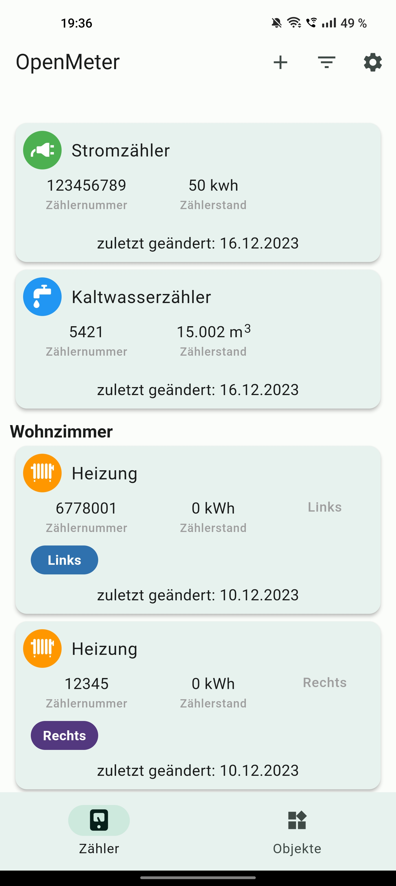
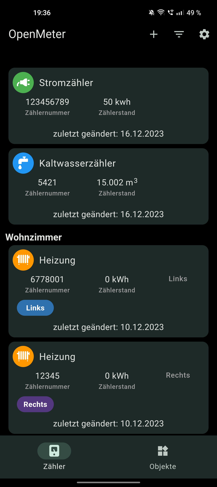
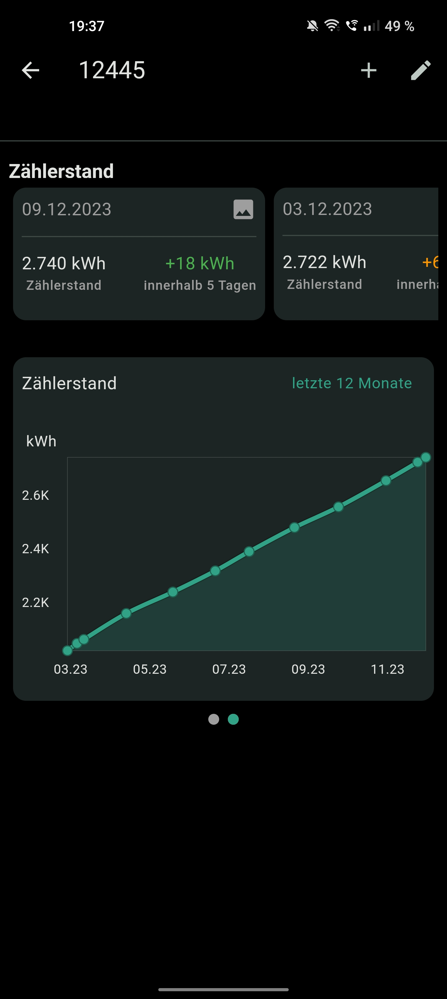
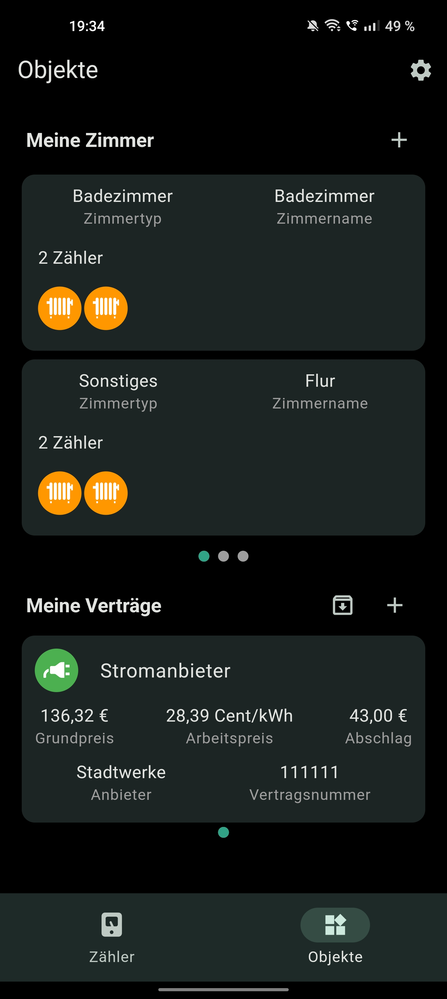

# OpenMeter

Is a simple app to note the current meter reading and keep track of his usage.
 
The app is currently a work in progress and is being developed to further enhance my Flutter experience.
 
Over time, many more features are to be added and eventually the app will be released to the app stores.

### Screenshots

<pre >
 &nbsp;  &nbsp;  &nbsp;   
</pre>

### Current functions

- compare contracts
- create tags and assign them to meters
- daily, weekly or monthly reminders for meter reading (currently android only)
- keep display awake
- part meter in rooms
- add pictures to entries
- toggle flashlight
- export/import database + create autobackups
- material 3 design + dark mode 